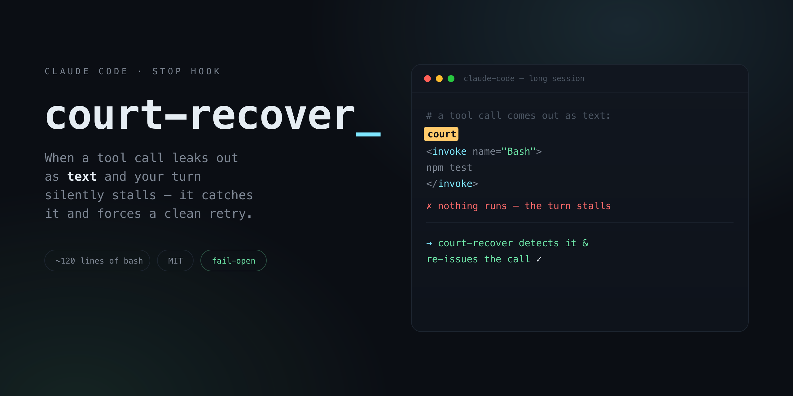

# court-recover

A tiny [Claude Code](https://docs.anthropic.com/en/docs/claude-code) **Stop hook** that catches the
"tool-call-as-text" stall and forces a clean retry. ~100 lines of bash. Fail-open. Needs only `bash` + `python3`.

> 日本語: Claude Code を長時間回すと、tool 呼び出しが「テキスト」で漏れて(`court`/`count` 等のトークン + 生の `<invoke>` markup)、何も実行されず無言でターンが止まるバグを検知し、正しい呼び出しに自動で出し直させる小さな Stop hook。約120行 bash・fail-open・MIT。



---

## The bug it fixes

In long or degraded sessions, the model sometimes emits a tool call as **literal text** instead of an
actual structured tool call. You get a stray token (`court`, `call`, `count`, `course`) alone on a line,
immediately followed by raw `<invoke name=...>` markup written as if it were prose:

```
court
<invoke name="Bash">
<parameter name="command">npm test</parameter>
</invoke>
```

Because it is *text*, **nothing executes**. The result:

- **Autonomous / agentic loops stall silently** — the turn "ends" having done nothing, and the loop sits there.
- **Interactive sessions reply, then do nothing** — the model says "running the tests now…" and… doesn't.

It is intermittent, it shows up exactly when you're not watching, and there is no off-the-shelf fix.
Claude Code has no output-stream rewrite hook, so you can't strip the bad markup mid-stream. The feasible
fix is to **detect it after the turn and force a bounded clean re-issue** — which is all this hook does.

## What it does

Registered as a `Stop` hook, on each turn it:

1. Reads the last assistant message (from the Stop payload's `last_assistant_message`, falling back to the transcript).
2. Checks for the malformed signature (canary token + raw `<invoke>` markup + no real tool call).
3. If found, **blocks the stop** and tells the model to re-issue the *same* call as a real tool call.
4. Bounded: after `N` attempts (default 2) it gives up and lets the turn stop.
5. Any error in the hook itself → it does nothing (fail-open). It can never freeze your session.

## Install

1. Drop `court-recover.sh` somewhere (e.g. `~/.claude/hooks/court-recover.sh`) and make it executable:

   ```bash
   chmod +x ~/.claude/hooks/court-recover.sh
   ```

2. Register it as a `Stop` hook in `~/.claude/settings.json`:

   ```json
   {
     "hooks": {
       "Stop": [
         {
           "hooks": [
             { "type": "command", "command": "$HOME/.claude/hooks/court-recover.sh" }
           ]
         }
       ]
     }
   }
   ```

That's it. Already have a `Stop` hook? Add this as a second entry in the same array — Claude Code runs them
all, and a `block` from any one is enough.

## How it avoids false positives

The detection signature is deliberately tight, so a turn that merely *discusses* the bug — in prose, or in a
code fence with text after it — is not flagged. All of these must hold:

- a canary token sits **alone on a line**, **immediately followed** by a line starting with `<invoke name=`,
- the message text **ends** with the emitted call markup (`</invoke>`) — i.e. the turn actually terminated into it,
- the message contains **no real `tool_use` block**.

One residual edge case: a legitimate message that *ends* on a raw, unfenced sample of the exact malformed
markup (with nothing after it) would be flagged. It's rare, and bounded — at most `COURT_RECOVER_CAP`
re-issues, then the turn is allowed to stop.

## Config (env vars, all optional)

| Var | Default | Meaning |
|---|---|---|
| `COURT_RECOVER_CAP` | `2` | Max forced re-issues per session before giving up (non-numeric → treated as `2`) |
| `COURT_RECOVER_TOKENS` | `court\|call\|count\|course` | Regex alternation of canary tokens to watch for |
| `COURT_RECOVER_LOG` | `~/.claude/logs/court-recover.log` | Log file path |

## Why fail-open

A Stop hook that *blocks* sits on the critical path of every turn. A bug in it could freeze your session.
So every error path here exits `0` (let the turn stop). The worst this hook can do is *nothing* — never harm.

## The name

`court-recover` is named after the stray tokens — `court` / `count` / `call` / `course` — that signal the
bug. They're the canary in the coal mine.

## License

MIT — see [LICENSE](./LICENSE).
